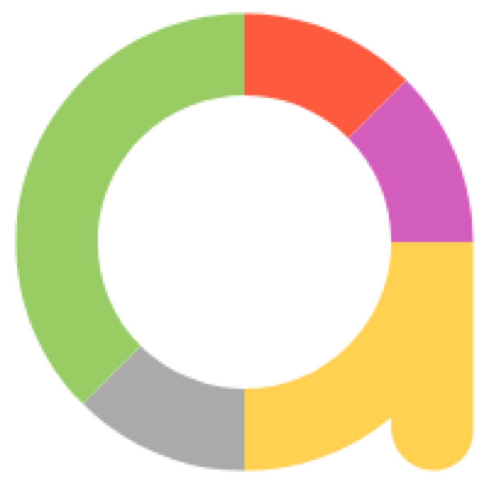

<h1 align="center"> Привет, я Илья 👋</h1>
<h3>О себе</h3>
Я QA Engineer с 2017 года. Имею опыт тестирования программно-апаратных комплексов и решений. В данный момент, изучаю автоматизацию QA на Java.

### Мои проекты

:desktop_computer: [UseTech.ru](https://github.com/ilyakhabarov/UseTechTest) - тестовый демо-проект для UseTech.ru

### Стек

  

  

  

### Статистика

### Контакты

<!--
**ilyakhabarov/ilyakhabarov** is a ✨ _special_ ✨ repository because its `README.md` (this file) appears on your GitHub profile.

Here are some ideas to get you started:

- 🔭 I’m currently working on ...
- 🌱 I’m currently learning ...
- 👯 I’m looking to collaborate on ...
- 🤔 I’m looking for help with ...
- 💬 Ask me about ...
- 📫 How to reach me: ...
- 😄 Pronouns: ...
- ⚡ Fun fact: ...
-->
